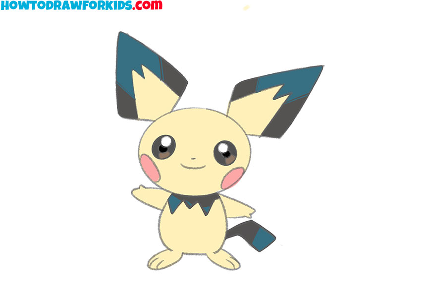

# Eraser

Eraser is a JavaScript implementation that allows dynamic erasing of parts of an image displayed on a `<canvas>` element. This tool can be used for interactive experiences where users "scratch" a surface to reveal or hide an image.

## Features

- Dynamically load images from user input.
- Interactive erasing with mouse or touch gestures.
- Automatically adjusts the canvas size to fit the screen.
- Download the modified canvas as a PNG image.

## Installation

1. Download or clone this project repository.
2. Place the main JavaScript file (`eraser_custom.js`) in the `./js/` folder.
3. Embed the provided HTML into a webpage.

## Usage

### Prerequisites
- An image file to be partially erased (provided via a file input).
- A browser that supports `<canvas>` and touch events.

### Steps

1. **Add an image:**  
   Click the `<input>` element to select an image from your device. The image will be displayed on the canvas.

2. **Erase:**  
   Use your mouse (on a computer) or finger (on a touch device) to scratch the image and partially erase it.

3. **Download:**  
   Click the `Download` button to save the canvas as a PNG image.

4. **Submit:**  
   Click `Envoyer` to mark the canvas as manipulated.

## Core Code

### Main Files

- `index.html`: Contains the user interface, including the canvas and interactive buttons.
- `eraser_custom.js`: Handles the interactive erasing functionality.

### Internal Functionality

#### `Eraser` Class

The main class, `Eraser`, performs the following operations:
- Loads an image onto a canvas and resizes it to fit the screen.
- Sets up erase events (`touchstart`, `touchmove`, `touchend`, or mouse equivalents).
- Applies a `destination-out` drawing mode to erase parts of the image.
- Analyzes the percentage of visible pixels on the image and, once a certain threshold is met (less than 60% visible pixels), disables interaction.

#### Key Events
- **`tapstart`:** Initializes the erasing action from a specified position.
- **`tapmove`:** Draws a line between two points to erase parts of the image.
- **`tapend`:** Checks if a significant portion of the image has been erased and removes the interaction if necessary.

### Customization Example

You can adjust the following parameters in the `eraser_custom.js` file:
- **`lineWidth`**: The width of the eraser (default: 55).
- **`gap`**: Spacing between pixel checks (default: 10).
- **Coordinates for start and end positions (`tap_start_x1`, `tap_move_x2`, etc.)**

## Dependencies

No external dependencies are required. The project relies solely on native JavaScript and the DOM API.

## Screenshot

